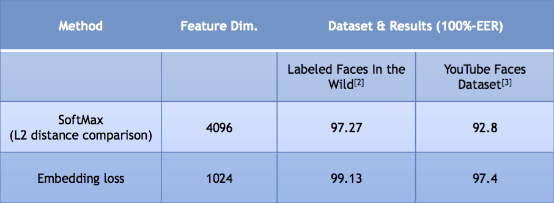
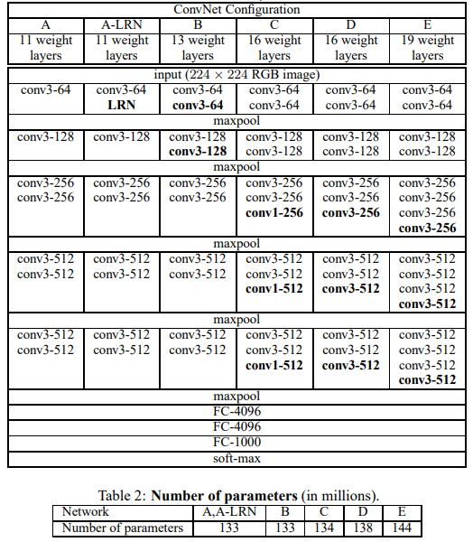
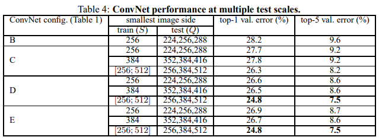

# VGGCmp
 基于VGGFace实现的人脸识别认证网络

# VGGFace
VGGFace是牛津大学视觉几何团队联合Google在其先前开发的图像分类网络VGGNet的基础上设计的面部图像分类算法。该算法的创新点主要有二：其一是VGGFace继承了VGGNet在图像分类领域的优秀表现，其二是将度量学习（metric learning）的思想应用于面部特征的比较判定。VGGFace网络在其所采用的两个数据集（LFW-Labeled Faces in the Wild与YFD-YouTube Faces Dataset）上均取得了97%以上的正确率。

（图片来源：[牛津大学VGG Face Descriptor官网](https://www.robots.ox.ac.uk/~vgg/software/vgg_face/)）

## VGGNet
VGGNet是一套由AlexNet发展而来的网络，该套网络中具有最佳表现的是分别有16和19个可训练层的VGGNet16与VGGNet19。值得一提的是，该网络获得了2014年ILSVRC竞赛的亚军（当年冠军为GoogleNet）。VGGNet体系下各网络的结构及参数规模如下：

同时，上述网络在多尺度的识别对象数据集下（scale jittering）的表现如下

（以上两图来源：[VGGNet原论文：Very Deep Convolutional Networks for Large-Scale Image Recognition](https://arxiv.org/pdf/1409.1556.pdf)）
网络精度的评估数据表明，VGGNet的精度随着卷积层数的增长在VGGNet16及VGGNet19的达到极限，这也是它们被应用于VGGFace的主要原因之一。
VGGNet以相对较低的网络规模（不超过150M）取得较高精度的主要原因在于牛津大学视觉几何团队在网络设计中所采用的两条原则：
- 以更多层小核卷积层代替单层大核卷积层，则可以以更低的计算量实现更高的精度。
   > Rather than using relatively large receptive fields in the first conv. layers, we use very small 3 × 3 receptive fields throughout the whole net, which are convolved with the input at every pixel. It is easy to see that a stack of two 3×3 conv. layers (without spatial pooling in between) has an effective receptive field of 5×5; three such layers have a 7 × 7 effective receptive field. 
   > 
   > assuming that both the input and the output of a three-layer 3 × 3 convolution stack has $C$ hannels, the stack is parametrised by $27C^2$ weights; at the same time, a single 7 × 7 conv. layer would require $49C^2$ parameters, i.e. 81% more. 
- 用卷积层代替全连接层
   > GoogLeNet (Szegedy et al., 2014), a top-performing entry of the ILSVRC-2014 classification task, was developed independently of our work, but is similar in that it is based on very deep ConvNets and small convolution filters. Their network topology is, however, more complex than ours, and the spatial resolution of the feature maps is reduced more aggressively in the first layers to decrease the amount of computation. As will be shown in Sect. 4.5, our model is outperforming that of Szegedy et al. (2014) in terms of the single-network classification accuracy.

## VGGFace中的度量学习思想
虽然VGGFace仅采用有限个分类的面部照片（2622类）进行训练，但视觉几何团队希望该网络实现如下功能：网络直接输出更低维的特征向量（论文中采用1024维），不同面部图片得到的这一特征向量可以直接通过其间的欧氏距离反映面部特征匹配与否——因此VGGFace团队在网络训练中采用了深度度量学习式的残差。
> 度量学习研究如何在一个特定的任务上学习一个距离函数，使得该距离函数能够帮助基于近邻的算法取得较好的性能。深度度量学习（Deep Metric Learning）是度量学习的一种方法，其主要思想是利用神经网络实现高维特征向量到低维特征的映射（此处的低维空间称为嵌入空间Embedding Space），使得不同嵌入空间向量可以在其度量（距离）上反映其是否属于同一类。
> 
> 除了面部特征匹配，度量学习还可用于图像检索、签名验证、行人重识别等。

VGGFace引入了度量学习中常用的Triplet loss：
$$L_{\pi}(a, a^+, a^-) = \sum_{(a, a^+, a^-)\in\mathbb{T}} {\text{ReLU} \left(
   \|\boldsymbol{x}_a - \boldsymbol{x}_{a^+}\| - \|\boldsymbol{x}_a - \boldsymbol{x}_{a^-}\| - \alpha
\right)}$$
其中：
- $\pi$：网络权重
- $a, a^+, a^-$：一组样本的下标，前两样本与最后一个样本属于不同类别
- $\mathbb{T}$：样本（训练）集
- $\text{ReLU}$：整流函数
- $\boldsymbol{x}_a$：嵌入空间向量
- $\alpha$：希望同类、异类嵌入空间向量距离所具有的普遍差异

在VGGFace中，论文团队在初始数据集上以分类任务训练好VGGNet后，将网络的最后一层更换为输出数等于嵌入空间维数的单层全连接网络（并在单层网络前额外引入一个输出正则化），之后利用Triplet loss对新加入的全连接进行单独训练。

# 数据集
本项目使用哥伦比亚大学PibFig公众人物人脸数据集进行训练与测试。本节将主要介绍数据集的基本情况及获取方法。

## 数据集简介
PibFig数据集的简介如下：
> The PubFig database is a large, real-world face dataset consisting of 58,797 images of 200 people collected from the internet. Unlike most other existing face datasets, these images are taken in completely uncontrolled situations with non-cooperative subjects. 

PibFig数据集的具体指标如下：
- 数据集用途：人脸识别、人脸目标检测等
- 数据集呈现形式：图片来源url
- 数据集表项：
  - person/人名
  - imagenum/（同一人名下的）图片序号
  - url/图片来源url
  - rect/人脸在图片中的位置
  - md5sum/图片MD5校验码
- 数据集大小：
  - 训练集：60人-共16336张图片
  - 测试集：140人-共42461张图片
原生数据集相关文件详见[原生数据文件夹`./dataset/PubFig`](./dataset/PubFig)及[原数据集官网](https://www.cs.columbia.edu/CAVE/databases/pubfig/download/)

## 数据集压缩
针对于本项目所要完成的人脸认证任务，我们对数据集进行了如下筛选：
- 由于数据集中的url大量失效，以及考虑到本项目所采用的网络规模并不大，故对于每一识别对象仅采用前10张url有效的图片
- 由于本项目不涉及目标识别，故预先根据数据集内的位置标识对原图像进行裁剪，并统一调整为128×128大小（VGGFace输入大小）

## 数据集获取：原url下载
可通过在项目文件夹下运行如下命令，以手动按照前述数据集压缩设置下载并裁剪数据集图片至`./dataset/train`与`./dataset/eval`:
1. 切换至`./dataset`文件夹
   ```
   cd dataset
   ```
2. 将`./dataset/PubFig`下的原数据集txt文件转换为csv文件并保存至`./dataset/csvs`以便后续处理
   ```
   python txt2csv.py
   ```
3. 开始下载前，建议启动VPN，否则大部分图片将无法获取
4. 下载图片至`./dataset/train`与`./dataset/eval`
   ```
   python im_download.py
   ```
当然，您可以通过修改`./dataset/im_download.py`中的参数，以对下载设置进行调整

## 数据集获取：预下载范例数据集
由于原数据集提供的url连接并不稳定，故在`./VGGCmp_dataset.zip`内提供了已经按照“数据集压缩”中要求下载并处理好的数据集图片，将其解压并将对应图片复制到前述相应文件夹即可使用。

## 训练集
训练集的